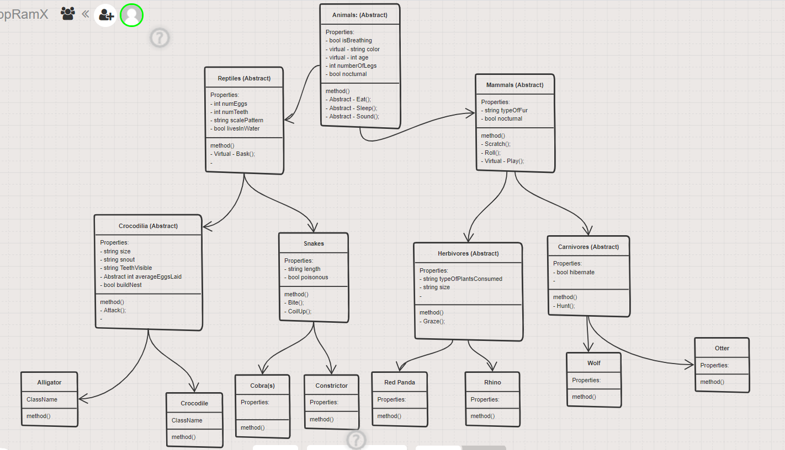

# Lab06-OOP Principles & Lab 07-Interfaces

## Authors: JP Jones, Jordan Kidwell

## Overview:
- This lab was created to understand OOP principles and how to utilize them. We created multiple classes that would inherit methods and properties. After all of this was built out, we created tests that check if the inheritance accurately.

## Getting Started:
- Clone down this repository to your local machine, follow the clone usual. (Git clone "clonedrepo" enter vsc) and view all tests.

## OOP Principles:
- **Inheritance**: A class that is implementing another, as it has to access the parent properties.
- Everything was inherited, aside from the concrete ones.
- **Abstraction**: This is a template/or a blueprint if you will, for other classes. Children of this must implement anything abstract. 
- We utilized abstraction in all of our classes except for the concrete ones. 
- **Polymorphism**: This is utilized to modify or alter methods and properties alike within children classes. 
- **Interface**: Similiar to inheritance except we can utilize multiple interfaces.

## Interfaces Used:
- **ICreep**: All animals that we have listed have the ability TO creep, therefore we used this as our interface.
- **ISwimmingly**: We utilized this with almost ALL of our animals, as most animals/reptiles do the act of swimming.

## Architecture:
- C# and VSC with use of inheritance. 

## Visual

## Version
- 01/18/21: Version 1.0.0
- 01/19/21: Version 1.0.1 

## Change Log:
- 01/18/21: This is when we got to set up our many classes, methods and properties.
- 01/19/21: We finished up the remaining classes and wrote out the tests to check for inheritance. From there, we created our two interfaces and implemented into each class that was applicable. Readme was updated as well.